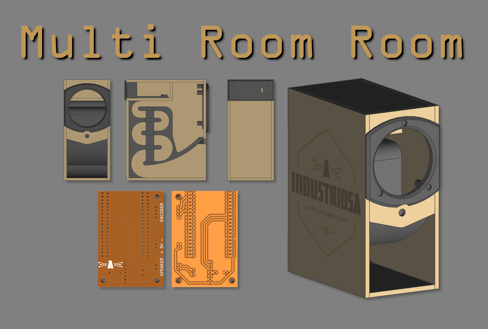

Multi Room Room é un sistema de audio inalámbrico multi-habitación baseado en ESP32, Squeezelite[(1)](#1-httpsgithubcomsle118squeezelite-esp32) e Lyrion[(2)](#2-httpsgithubcomlms-communityslimserver). Permite a implementación dun sistema de fío musical inalámbrico de baixo custo e con tecnoloxías abertas. Neste repositorio atópanse as listas de materiais, deseños de placas electrónicas e caixas así como as instruccións para a posta en marcha do sistema.

## Documentación

[Documentación en galego](./docs/gl/INDICE.md)

Documentation in English (In progress)

## Referencias

#### [(1) https://github.com/sle118/squeezelite-esp32](https://github.com/sle118/squeezelite-esp32)

#### [(2) https://github.com/lms-community/slimserver](https://github.com/lms-community/slimserver)