# Caixa tipo "back loaded horn"

Deseño de caixa tipo *back loaded horn* baseado no deseño de **@guppyk** en thingiverse [(1)](#1-httpswwwthingiversecomthing4668173).

Esta caixa está pensada para replicar o deseño de **@guppyk** pero adaptándoo para poder facer a maior parte da caixa de madeira empregando corte láser. O resto de partes mantéñense en impresión 3D.

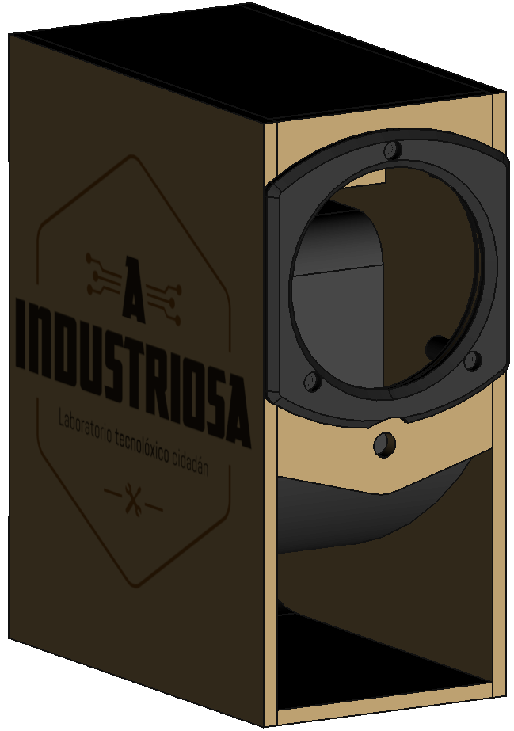

# Corte láser

O deseño está pensado para que se poida cortar nun taboleiro de **400x400x5mm**. Recoméndase o uso de DM ou contrachapado para este tipo de proxectos xa que ten mellores propiedades acústicas que a madeira natural Para isto pódese empregar o aquivo `hardware/simple_box/laser_cut.svg`

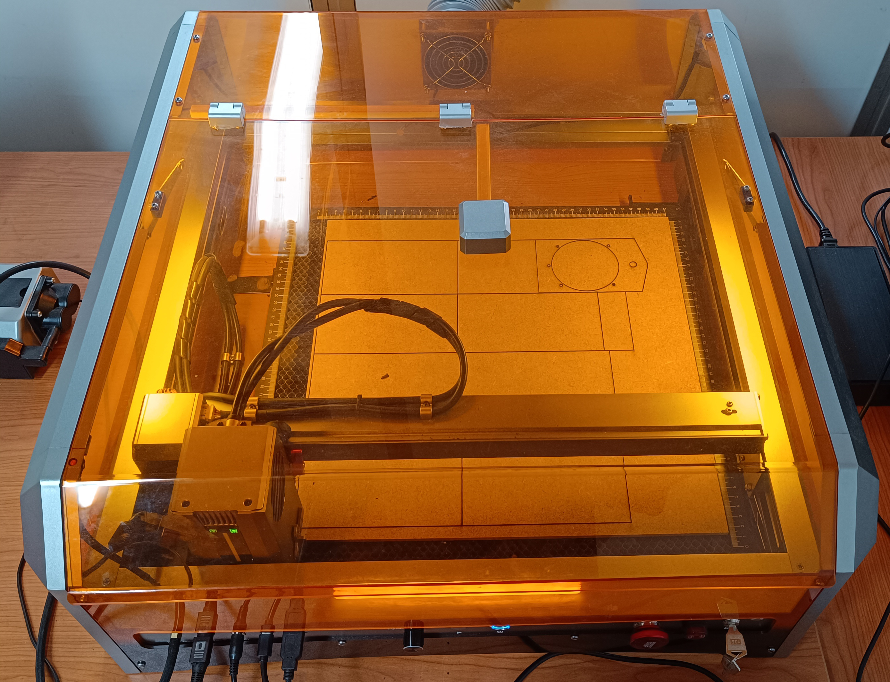

## Dimensions das pezas de madeira

### Frontal

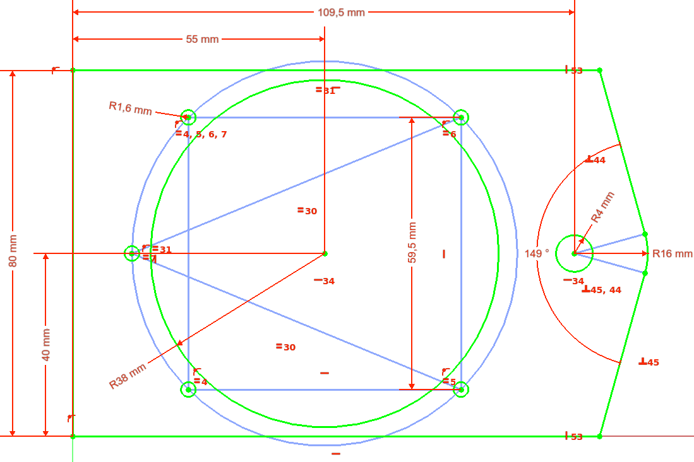

### Superior e traseira (2 pezas iguais)

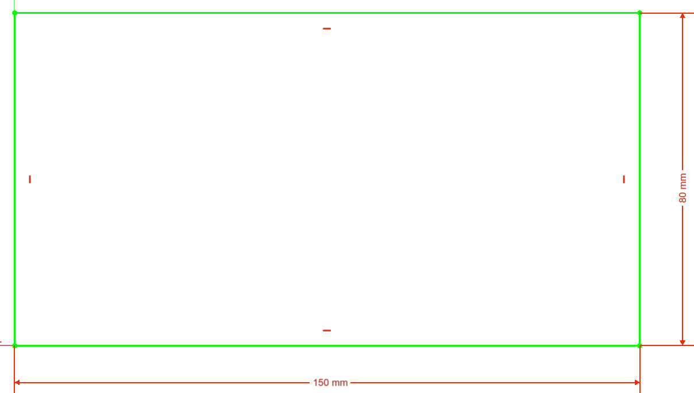

### Inferior

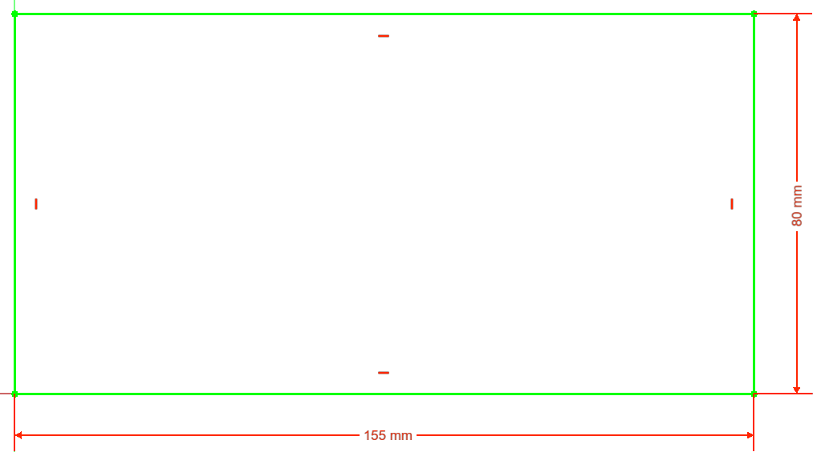

### Laterais (2 pezas iguais)

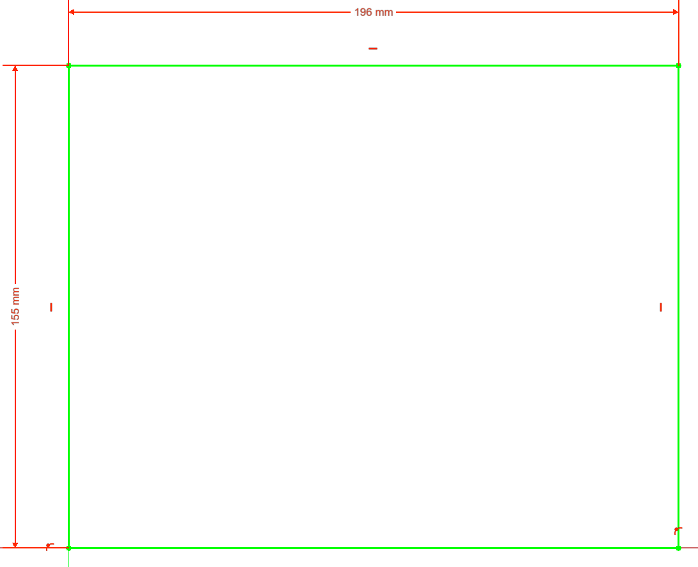

### Compartimento para a electrónica (peza traseira)

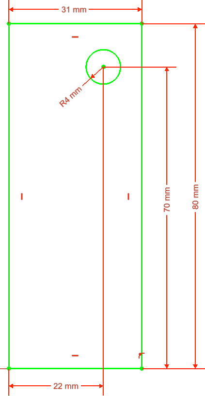

### Compartimento para a electrónica (peza inferior)

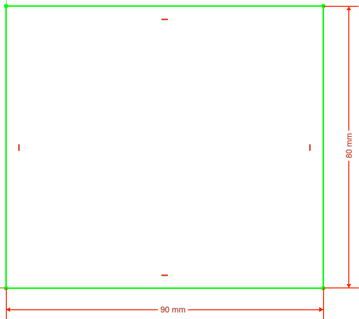

# Pezas impresas en 3D

Este tipo de caixas emprega unha canle en forma de guía de ondas cuxa sección se vai incrementando a medida que se afasta da fonte de son. Deste xeito a cancle contribúe a amplificar as frecuencias máis graves incrementando a súa presencia e mellorando así a respoista de woofers de pequeno tamaño que presamente teñen respostas bastante pobres neste rango.

No deseño orixinal todo o corpo da caixa do altofalante se fabrica en impresión 3D mentres que só os paneis laterais se fan en madeira. Nesta versión preténdese reducir o uso de impresión 3D por dúas razóns: por unha parte a madeira ten mellores propiedades acústicas que o plastica e por outra parte o corte mediante láser acelera de forma considerable o proceso de fabricación fronte á impresión 3D.

> **Todas as pezas están deseñadas para ser impresas sen utilizar soportes**

### Canle

O arquivo a imprimir é `hardware/caixa/canle.3mf`

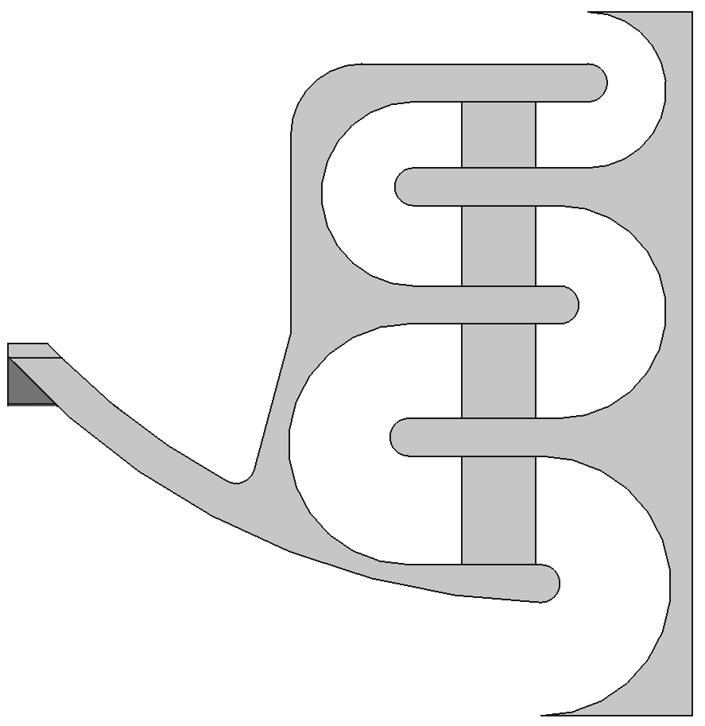

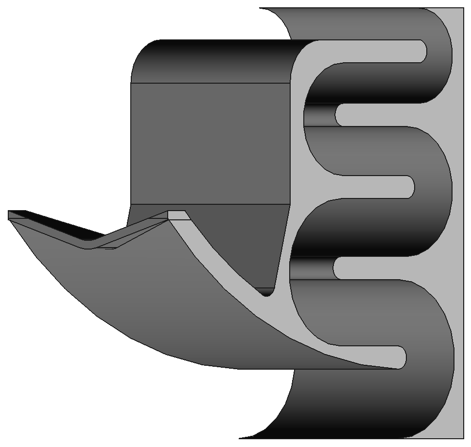

### Tapa traseira

A tapa traseira fai de soporte para a electrónica que se monta dentro da caixa ó tempo que proporciona unha parede traseira na que expoñer calquera conector que sexa necesario para o dispositivo. Neste caso únicamente se inclúe un conector micro USB para a alimentación pero poderíase de forma moi sinxela sustituir por ou engadir calquera outro tipo de conector que fose necesario.

O arquivo a imprimir é `hardware/caixa/tapa_traseira.3mf`

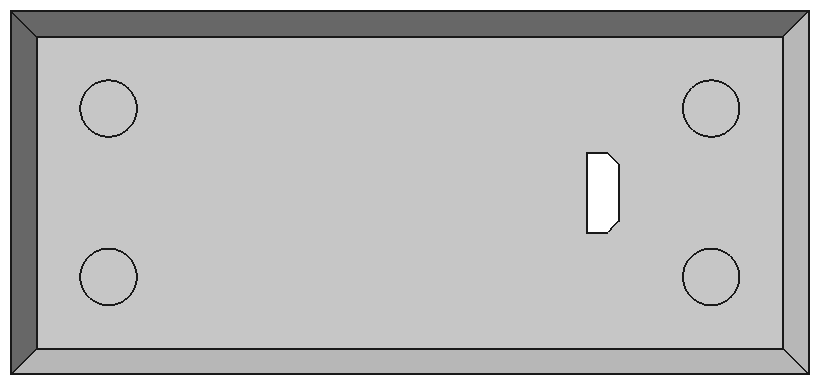

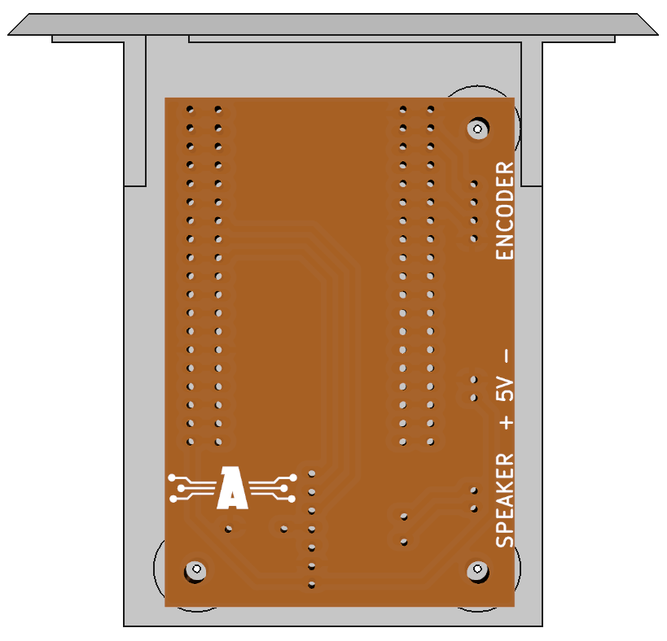

### Soportes para insertos

Xa que a madeira que se emprega é de 5mm de grosor non é posible a inserción de parafusos directamente na madeira. Para todas aquelas pezas que poidan requererir a súa desmontaxe deseñaronse soportes que van encolados na madeira e permiten o uso de insertos roscados nos que poden apertar os parafusos.

#### Soporte insertos woofer

O arquivo a imprimir é `hardware/caixa/soporte_insertos_woofer.3mf`

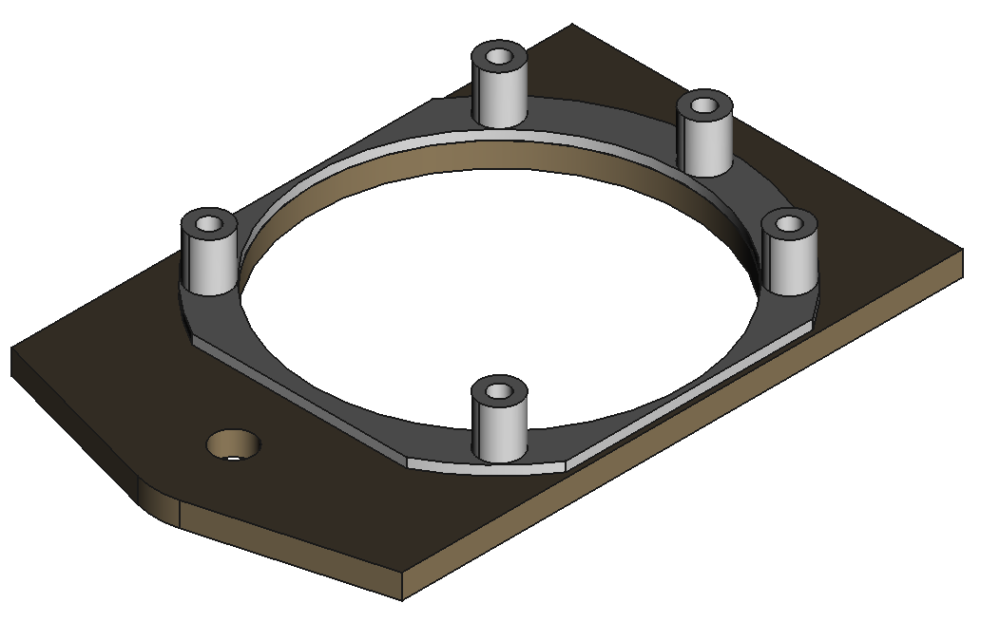

#### Soporte insertos tapa traseira (2 pezas)

O arquivo a imprimir é `hardware/caixa/canle.3mf`

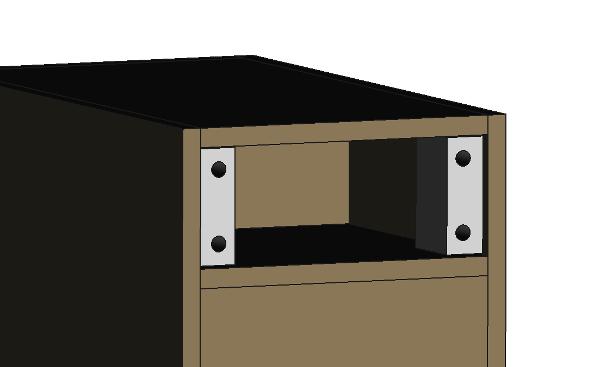

# Referencias

#### [[1] https://www.thingiverse.com/thing:4668173](https://www.thingiverse.com/thing:4668173)