# ESP32 + MAX98357A

Esta é a placa máis sinxela que permite implementar un altofalante dunha única canle (mono) e unha única vía (só un woofer). É a opción máis barata e compacta polo que é ideal se se queren fabricar múltiples unidades para cubrir unha estancia grande.

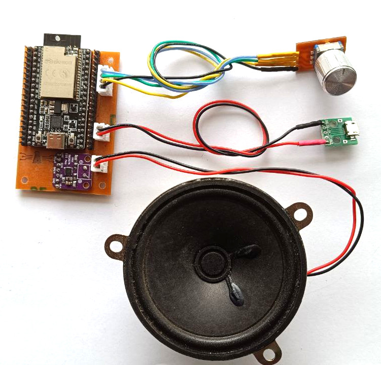

# Esquemático

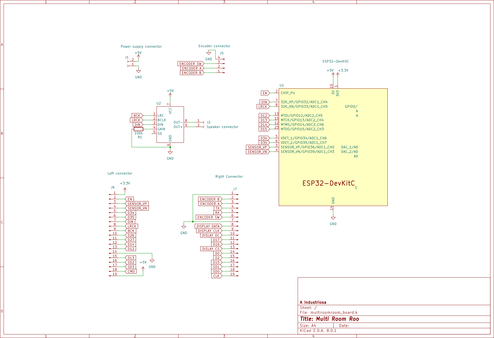

# Lista de materiais

| Elemento  | Descrición | Cantidade | Imaxe |
| ------------- | ------------- | ------------- | ------------- |
| **ESP32-DevkitC con módulo WROOVER** | Microcontrolador do sistema encargado de executar o firmware Squeezelite que recibe o audio por Wifi ou Bluetooth e o envía o DAC por I2S. | 1 | 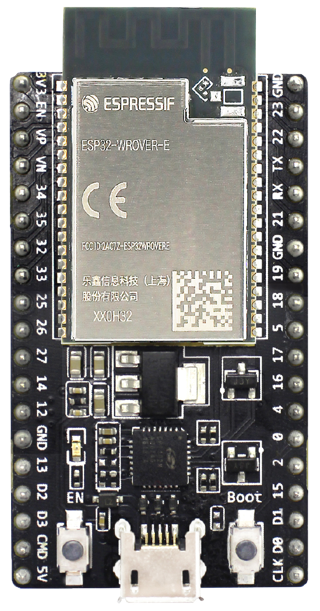 |
| **MAX98357A DAC I2S + Amplificador 3W** | Conversor dixital a analóxico con interfaz I2S e amplificador de 3W integrado nun mesmo chip. Recibe o audio dende o ESP32 por I2S e saca un sinal analóxico que se pode alimentar directamente ó altofalante. | 1 | 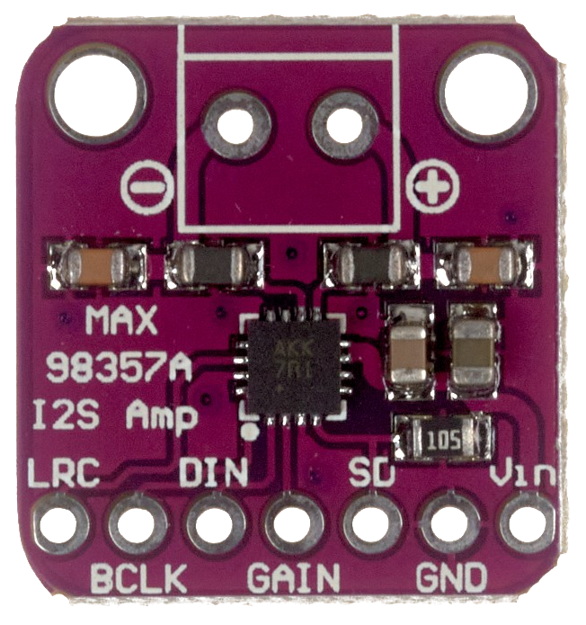 |
| **PCB FR-1 - 100x60 mm - 1 cara** | PCB de unha única cara utilizada para o mecanizado mediante CNC. Utilízase o sustrato FR-1 composto por fibras de papel debido a que durante o proceso de mecanizado se vai xerar pó do sustrato que sería altamente perigoso para a saúde se se tratase de materiais como baquelita ou fibra de vidro. | 1 | 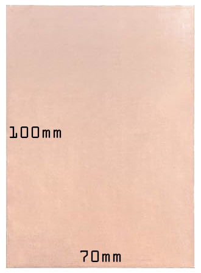 |
| **JST B2B-XH-A** | Conector JST de 2 pins con espaciado de 2.54 mm. Un para a alimentación e outro para a conexión do woofer. | 2 | 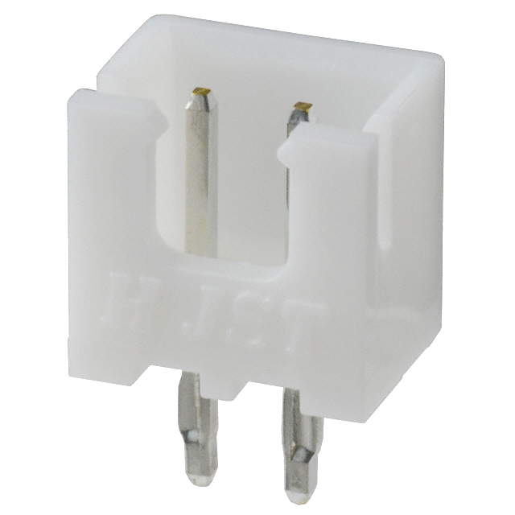 |
| **JST XHP-2** | Cobertura plástica para conextor JST de 2 pins e espaciado de 2.54 mm. Un para a alimentación e outro para a conexión do woofer. | 2 | 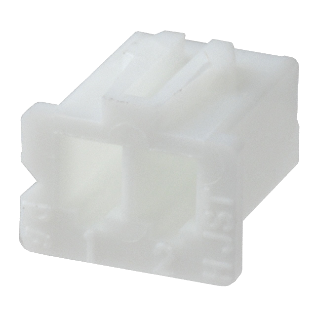 |
| **JST B4B-XH-A** | Conector JST de 4 pins con espaciado de 2.54 mm. Para a conexión do encoder. | 1 | 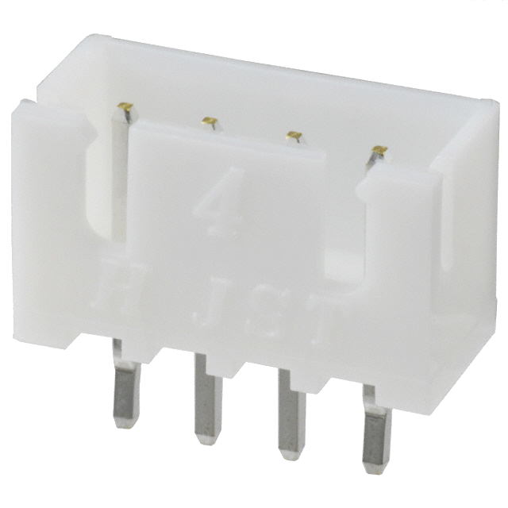 |
| **JST XHP-4** | Cobertura plástica para conextor JST de 4 pins e espaciado de 2.54 mm. Para a conexión do encoder. | 1 | 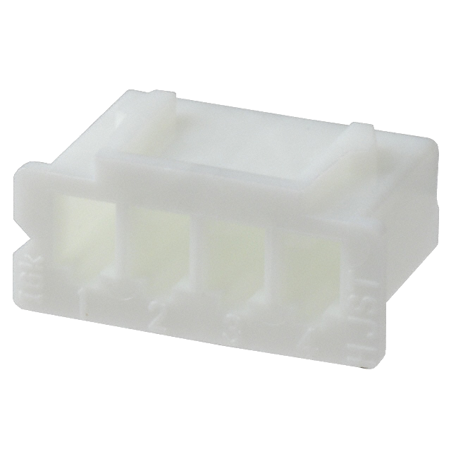 |
| **JST SXH-001T-P0.6** | Contacto metálico para crimpar. Parte dos conectores JST XH. | 8 | 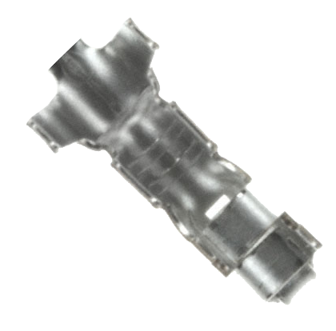 |
| **Cabeceiras 2.54 mm - 19 pins** | Cabeceiras de 2.54mm de espaciado para expoñer os pins do ESP32 para a conexión futura doutros periféricos. | 2 | 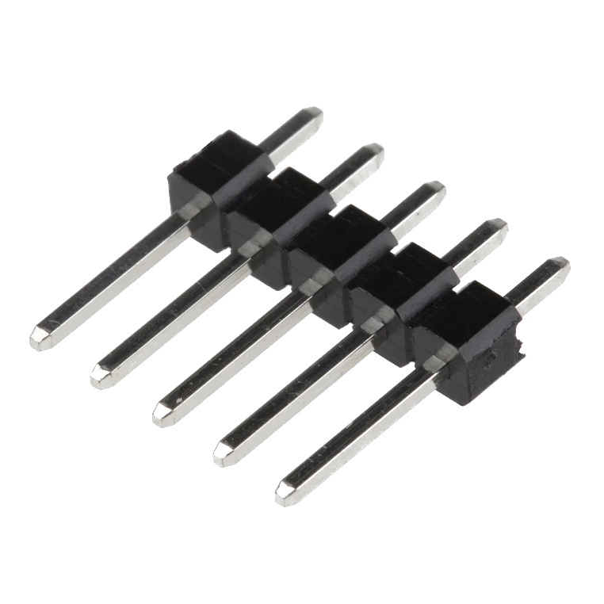 |
| **Cabeceiras 2.54 mm - 7 pins** | Cabeceiras de 2.54mm de espaciado para a conexión do DAC MAX98357A. | 1 |  |
| **Cabeceiras 2.54 mm - 2 pins** | Cabeceiras de 2.54mm de espaciado para a conexión do DAC MAX98357A. | 1 |  |
| **Resistencia 100 kohm** | Resistencia de 100 Kohm para configurar a ganancia do amplificador ó valor máximo. | 1 | 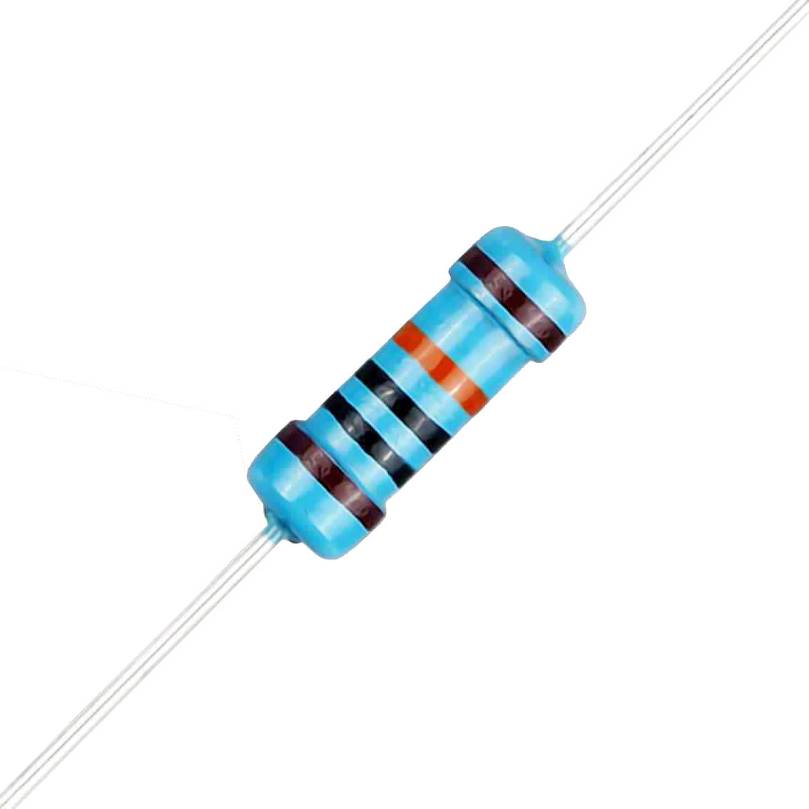 |
| **Encoder** | Encoder en cuadratura co pulsador integrado | 1 | 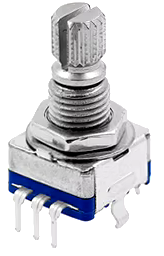 |
| **Woofer 3.3" 3W** | Altavoz de 3.3 pulgadas ou 70mm de diámetro de 4 ou 8 ohm e 3W de potencia. *Unha boa fonte para obter este tipo de woofers é a desmontaxe de antigos altofalantes de PC*. | 1 | 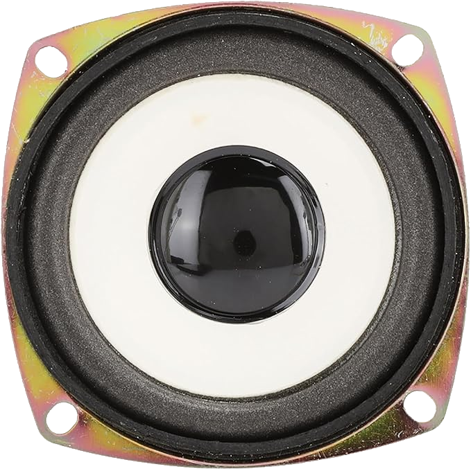 |
| **Conector micro USB con placa** | Conector micro USB empregado para a alimentacióne montado sobre unha PCB con conectores para cableado. | 1 | 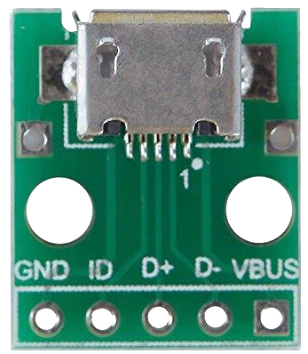 |

# Fabricación mediante CNC

A PCB para a montaxe dos distintos módulos está especialmente deseñada para a súa fabricación nunha CNC (tipo 3018 ou similar). Para xerar os G-code necesarios para alimentar a máquina proponse o uso da ferramenta pcb2gcode[(1)](#1-httpsgithubcompcb2gcodepcb2gcode) que permite ler os ficheiros de fabricación (Gerber) xerados por Kicad e obter como saída os G-code para o grabado das pistas, o taladrado dos buratos e o corte da propia PCB.

Para simplificar o uso desta ferramenta recoméndase o uso da interface gráfica pcb2gcodeGUI[(2)](#2-httpsgithubcompcb2gcodepcb2gcodegui) que permite a configuración de pcb2gcode de xeito máis visual. No cartafol `hardware/pcb2gcode` atópase o ficheiro `pcb2gcodeGUI.config` que contén a configuración recomendada para o mecanizado desta PCB nunha CNC 3018 empregando unha broca de 0.4mm para o gravado e outra de 0.8mm para os taladros e o corte.

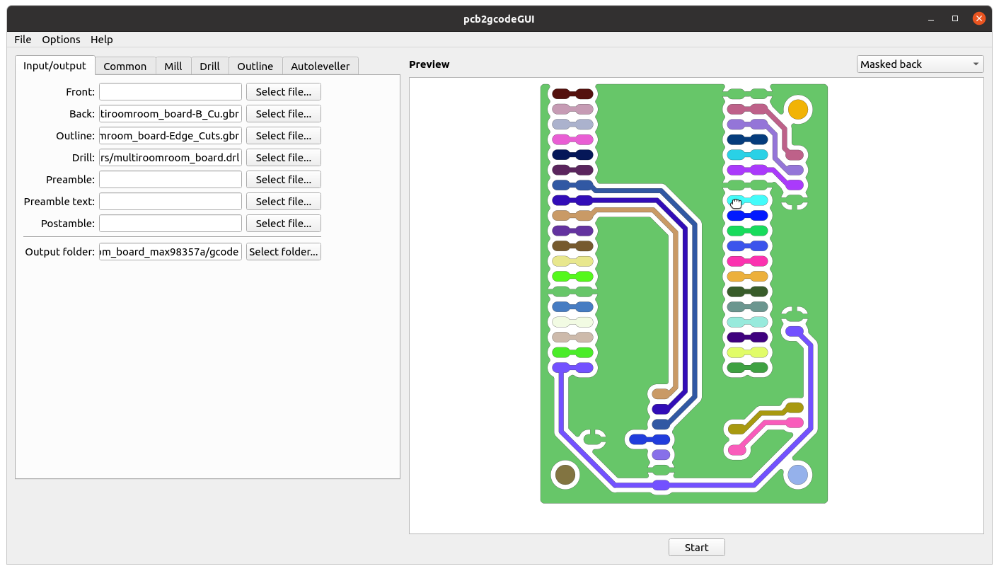

Seleccionar os arquivos Gerber xerados en Kicad para a fabricación colocando cada un deles na sección axeitada:

* **Back**: `hardware/multiroomroom_board_max98357a/gerbers/multiroomroom_board-B_Cu.gbr`
* **Outline**: `hardware/multiroomroom_board_max98357a/gerbers/multiroomroom_board-Edge_Cuts.gbr`
* **Drill**: `hardware/multiroomroom_board_max98357a/gerbers/multiroomroom_board.drl`
* **Output folder**: `hardware/multiroomroom_board_max98357a/gcode/`

No apartado **Common** deberase axustar o *Axis mirror offset* para que a esquina inferior esquerda da PCB quede aproximadamente na orixe de coordenadas. O valor será un pouco superior á metade do ancho da PCB a fabricar. Neste caso uns 25mm é suficiente. Isto é para evitar que o G-code xerado quede na parte negativa do eixo X o que pode dar problemas durante o mecanizado se non se ten en conta.

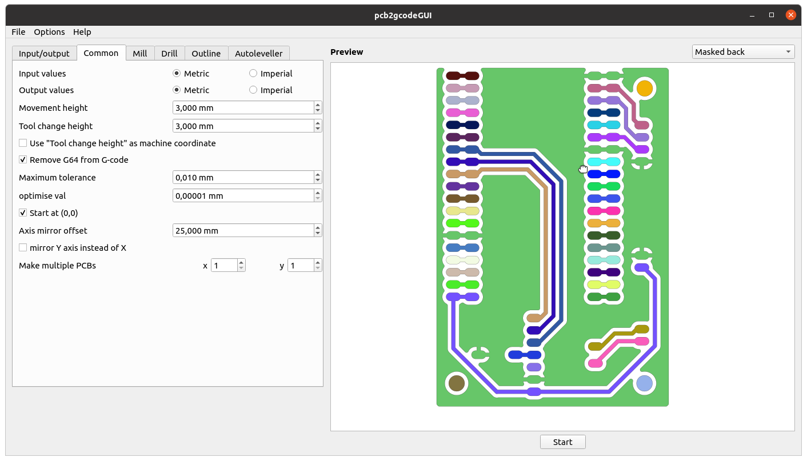

No apartado **Mill** poderase axustar a profundidade e a velocidade do gravado así como o espaciado entre pasadas. Típicamente este valor será a metade do ancho da fresa que se está empregando. Neste caso 0.2mm. Para a profundidade e a velocidade recoméndase facer probas coa maquina que se está a empregar para atopar os valores máis axeitados. 

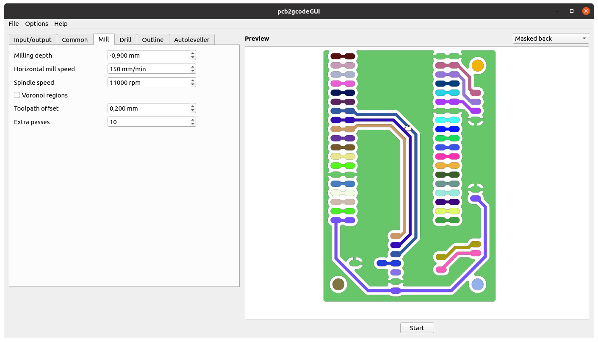

No apartado **Drill** poderase axustar a profundidade dos buratos, que deberá ser lixeiramente superior ó grosor da PCB que se está a mecanizar. Tamén se deberá axustar a velocidade e o diámetro da fresa que se está a empregar. É necesario utilizar fresas de menos de 1mm que é o diámetro dos buratos máis pequenos da PCB.

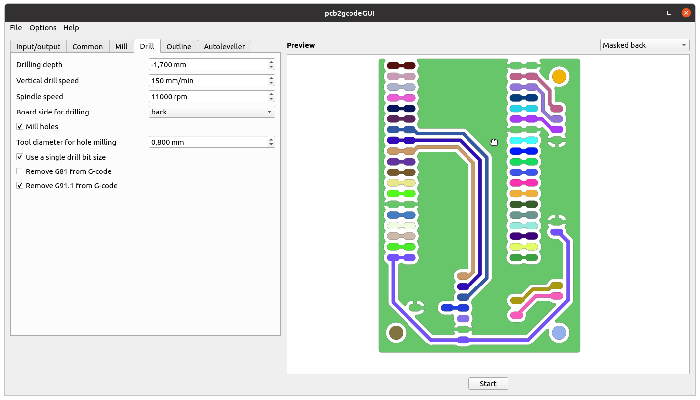

No apartado **Outline** poderase axustar a profundidade do corte, a velocidade de movemento e a profundidade máxima de cada pasada o que determinará en cantas pasadas se fará o corte total. Tamén se poderá configurar o uso de pestañas que se deixan sen cortar entre a PCB e o material sobrante para evitar que a PCB se mova durante o corte. Empregando pestañas de 1.5mm de ancho e 0.5mm de grosor asegúrase que a PCB non se moverá e se poderá separa de xeito sinxelo do resto da placa.

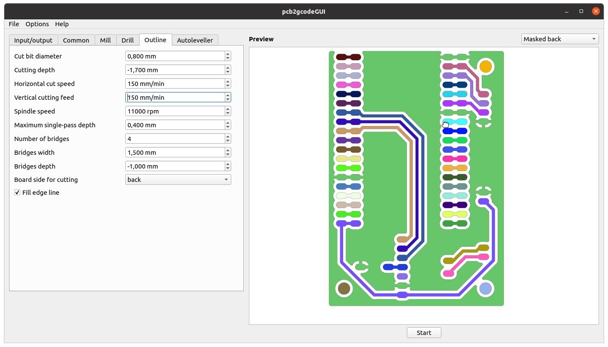

Por último pulsando no botón **Start** o programa procesará os arquivos proporcionados e xerará os G-code necesarios para cortar a PCB. Os arquivos resultantes serán:

* **back.nc**: G-code para o gravado da cara inferior da PCB.
* **milldrill.nc**: G-code para realizar os taladros na PCB.
* **outline.nc**: G-code para realizar o corte exterior da PCB.

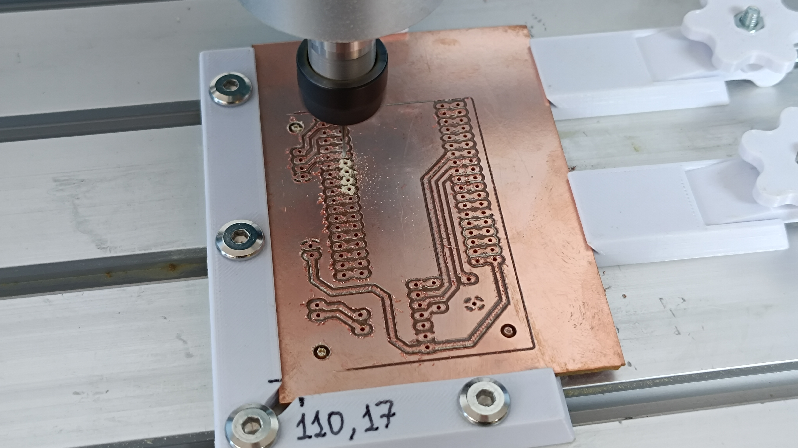

# Gravado da serigrafía mediante láser

TBD

# Referencias

#### [(1) https://github.com/pcb2gcode/pcb2gcode](https://github.com/pcb2gcode/pcb2gcode)
#### [(2) https://github.com/pcb2gcode/pcb2gcodeGUI](https://github.com/pcb2gcode/pcb2gcodeGUI)