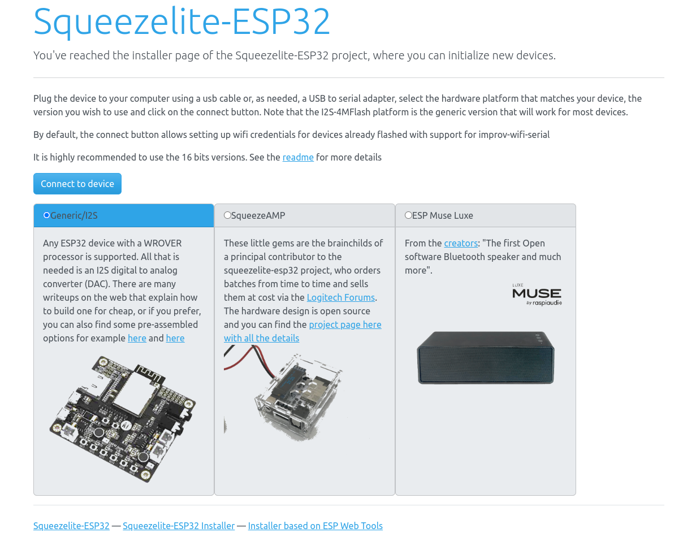
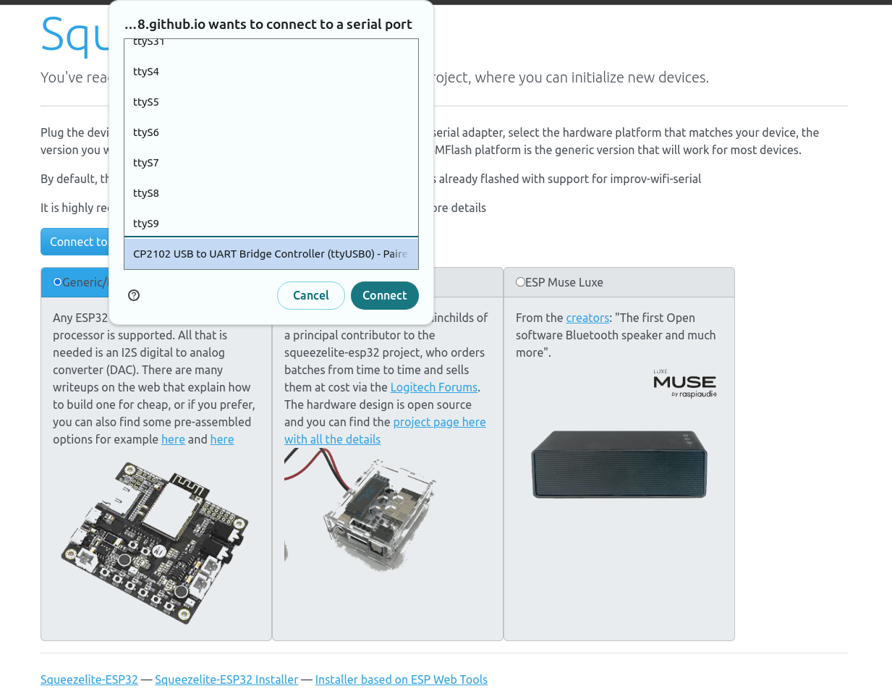
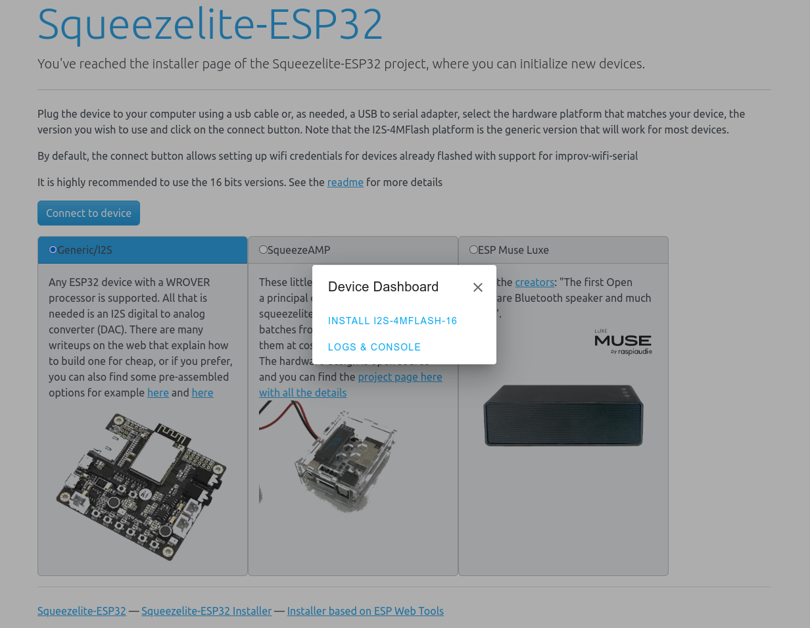
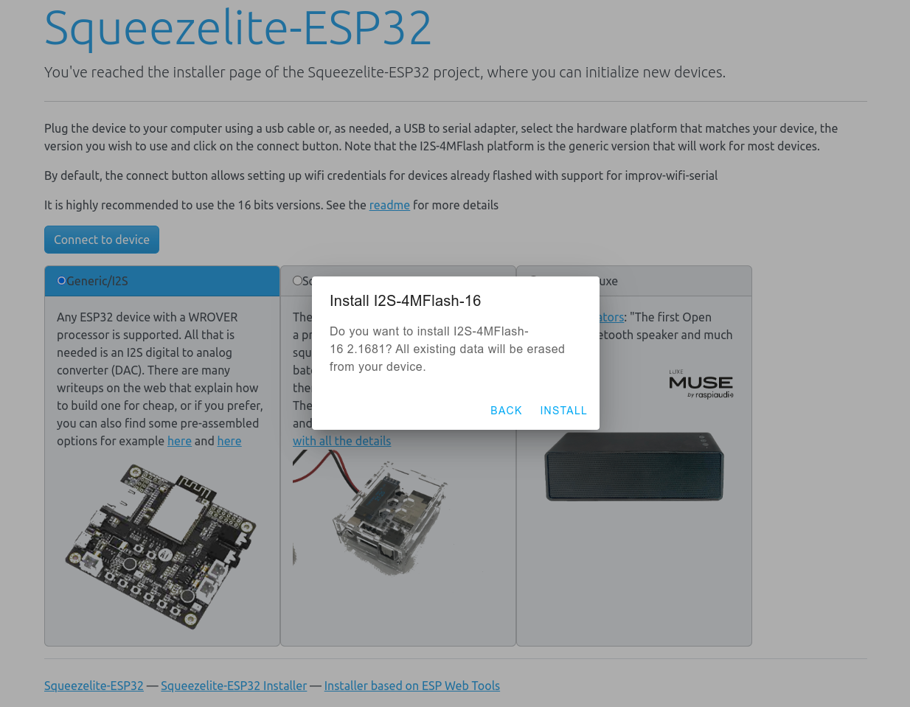
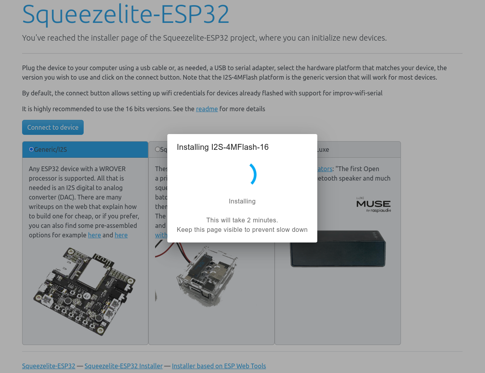
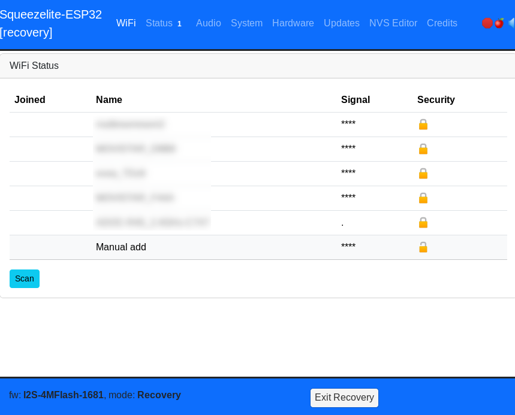
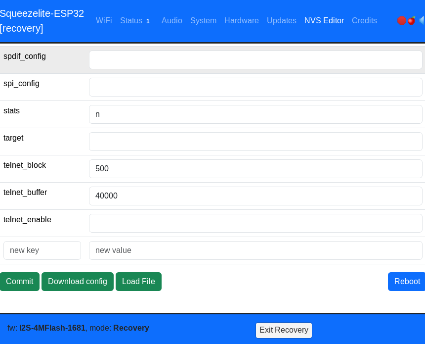
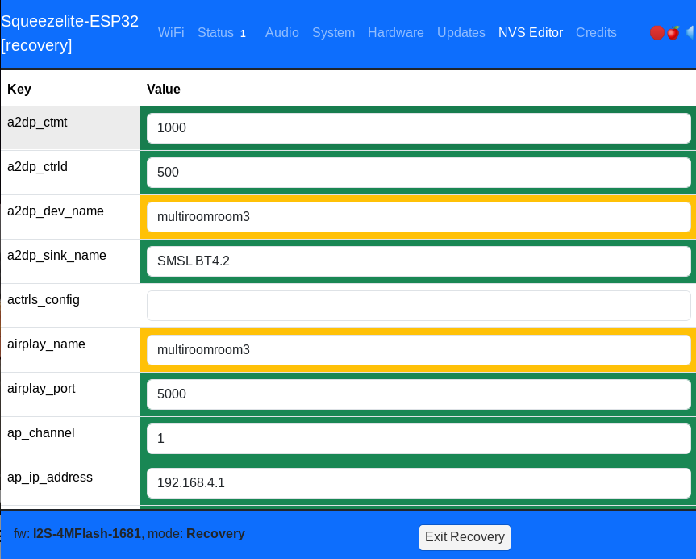

# Squeezelite ESP32

O firmware que se emprega para a recepción dos streams de audio nos altofalantes coñécese como Squeezelite-ESP32[(1)](#1-httpsgithubcomsle118squeezelite-esp32)

Squeezelite-ESP32 é un firmware para os microcontroladores ESP32 e ESP32-S3 de espressif. Ofrece as seguintes capacidades:

* Traballar como receptor de audio Bluetooth.
* Traballar como altofalante para servizos como Spotify connect ou Apple Airplay.
* Reproducción de audio de forma sincronizada utilizando o backend Lyrion (antigo Logitech Media Server).

Soporta unha grande cantidade de periféricos como:

* Botóns e encoders para distintas funcións (reproducción, pausa, pasar de canción, control de volume, etc).
* Expansores de GPIO para engadir máis botóns e LEDs.
* Receptor de infravermellos para control mediante mando a distancia (compatible con receptores de 38kHz).
* Pantallas monócromas, en escalas de grises ou a cor con conexión SPI ou I2C (compatible cos drivers SH1106, SSD1306, SSD1322, SSD1326/7, SSD1351, ST7735, ST7789 and ILI9341).
* Vúmetro con tira de LEDs WS2812B
* Conexión Ethernet compatble cos chip Microchip LAN8720 e Davicom DM9051/W5500.

Unha das funcións máis destacadas é que inclúe unha completa interface web para a configuración de todos os parámetros do dispositivo.

# Instalador de binarios precompilados

Para a instalación do firmware é posible utilizar o instalador web proporcionado en [https://sle118.github.io/squeezelite-esp32-installer/](https://sle118.github.io/squeezelite-esp32-installer/) o que permite instalar firmwares precompilados de xeito moi sinxelo.

A continuación conectar o ESP32-DevkitC Wroover cun cable USB-C ó PC e na interface web seleccionar a opción **Generic/I2S** e pulsar o botón **Connect to device**. No desplegable escoller o dispositivo USB que corresponda ó ESP (normalmente será un dispositovo CP2102) e pulsar en **Connect**.

Escoller a opción **Install I2S-4MFLASH-16**

Marcar a opción **Erase device** e pulsar en **Next**

Pulsar en **Install**

Agardar que remate o proceso de instalación

# Compilación e instalación

TBD

# Configuración

En canto o ESP32 teña instlado o firmwarae e se reinicie, aparecerá unha nova rede wifi co nome **squeezelite-identificador**. Deberase conectar o PC a esta rede introducindo o contrasinal **squeezelite**. Accedendo entón á dirección http://192.168.4.1 mostrase a interface web de configuración de Squeezelite.

O primeiro paso é conectar o dispositivo a unha rede wifi. Para iso no apartado **Wifi** pulsar o botón **Scan** se a rede ainda non aparece entre as detectadas. Unha vez que apareza seleccionala e introducir o contrasinal. Cando o dispositivo se conecte á rede aparecerá unha pequena fiestra indicando a nova IP do dispositivo dentro da rede Wifi á que se conectou.

Entrando na nova IP volverase recargar a interface web e poderase continuar coa configuración do dispositivo. A continuación cargarase o ficheiro de configuración por defecto para a placa ESP32 + MAX98357A. Para iso ir á sección **NVS Editor** e na parte inferior pulsar no botón **Load File**, seleccionar o archivo `software/multiroomroom_max98357a/nvs_multiroomroom_max98357a.json`

No editor amosaranse entón todos os cambios que se aplicarán co novo ficheiro cargado.

Recomendamos editar todos os campos nos que apareza o nome **multiroomroom1** para darlle ó dispositivo un nome axeitado. Tamén recomendamos modificar o cambpo **ap_pwd**. Este campo establece o contrasinal da rede wifi que o dispositivo pon en marcha a modo de recpueración ante a impsibilidade de conectar á rede wifi que se configurou previamente. Por último pulsar o botón **Commit** e **Exit Recovery** na parte inferior da pantalla.

Neste punto o dispositivo xa está listo para a súa conexión a un servidor Lyrion ou para recibir audio de Spotify Connect ou actuar como altofalante Bluetooth. A Desfrutar!!!

# Referencias

* #### [(1) https://github.com/sle118/squeezelite-esp32](https://github.com/sle118/squeezelite-esp32)