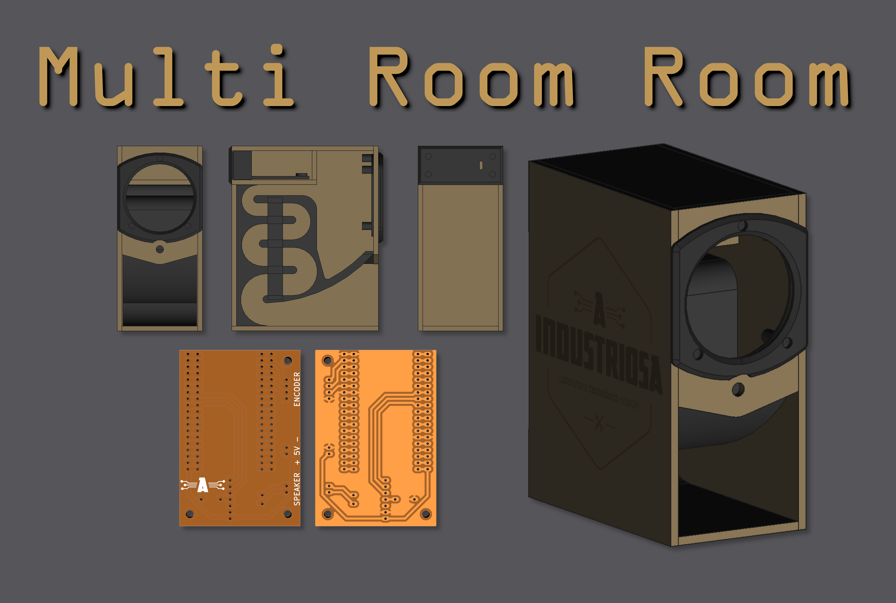

Multi Room Room é un sistema de audio multi habitación baseado no software [Lyrion](https://lyrion.org/), antigamente coñecido como Logitech Media Server. Este software componse dun servidor multimedia central que sen encarga do envío de fluxos de audio a dispositivos reproductores conectados na mesma rede local. Estes reproductores, coñecidos como _Squeeze Boxes_ poden funcionar de forma inalámbrica permitindo construir un sistema de fío musical onde os reproductores emitan o son de xeito sincronizado.

O obxectivo deste proxecto é conseguir un sistema de audio multi habitación inalámbrico de baixo custe e completamente aberto tanto en hardware como en software. 

* ### [Electrónica](./ELECTRONICA.md)

* ### [Caixa](./CAIXA.md)